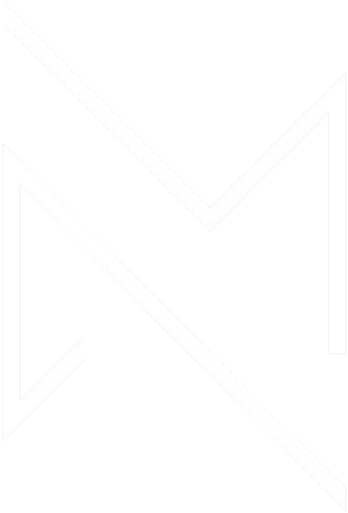

    

        

            
        

        

            Alex Montes
        

    

    

        

            

                🏠 <strong> Brooklyn, NY </strong>  
            

            

                🎓 <strong> Rensselaer Polytechnic Institute </strong>  
            

            

                &ensp; &#x2022; B.S. Computer Science '23  
            

            

                &emsp; &ensp; <i> Cognitive Science of AI Minor </i>  
            

            

                &ensp; &#x2022; M.S. Artificial Intelligence '24  
            

            

                💭 <strong> Interests </strong>  
            

            

                &ensp; &#x2022; Artificial Intelligence  
            

            

                &ensp; &#x2022; Machine Learning  
            

            

                &ensp; &#x2022; Software Engineering/Development  
            

            

                &ensp; &#x2022; Frontend Development  
            

            

                &ensp; &#x2022; Automation  
            

            

                &ensp; &#x2022; Cloud Computing  
            

            

                💼 <strong> Amazon SDE Intern (Summer '23) </strong>  
            

            

                🔧 <strong> Current Project </strong>  
            

            

                &emsp;&ensp; <a style="text-decoration: none;" href="https://alexmontes.net" target="_blank">alexmontes.net</a> (Portfolio Website)  
            

        

        
    

